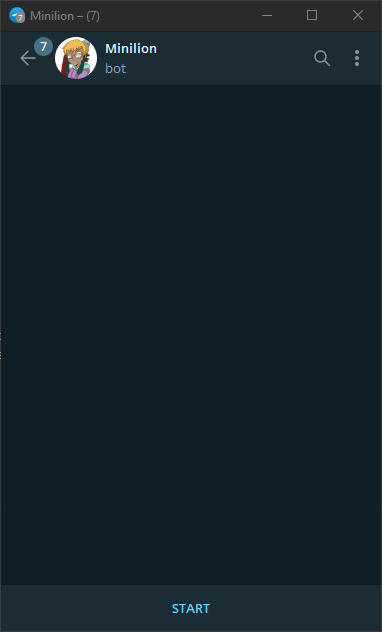

# telegram-chatgpt-bot

ChatGPT in your Telegram.

## Demo



## Features

- [X] Basic Features of ChatGPT
- [X] User whitelist
- [X] Select prefered language
- [ ] Markdown parsing

## Install

1. Prepare machine
    - Install NodeJS.
2. Clone repository
3. Install dependencies
```bash
npm install
```
4. Rename `chatgptbot.config.example.json` to `chatgptbot.config.json`
5. Prepare tokens
    - Create Telegram bot through [@BotFather](https://t.me/BotFather)
    - Generate OpenAI API Key [here](https://beta.openai.com/account/api-keys).
6. Insert tokens into the `chatgptbot.config.json`
7. *(Optional)* Add User ID to whitelist if you don't want anyone to use the bot. [Get User ID](https://t.me/userinfobot)
```json
{
    "whitelist": [
        123,
        345
    ],
    ...
}
```
8. Run bot:
```bash
npm run dev
```
Ready!

## Libraries

- [node-telegram-bot-api](https://www.npmjs.com/package/node-telegram-bot-api)
- [chatgpt](https://www.npmjs.com/package/chatgpt)